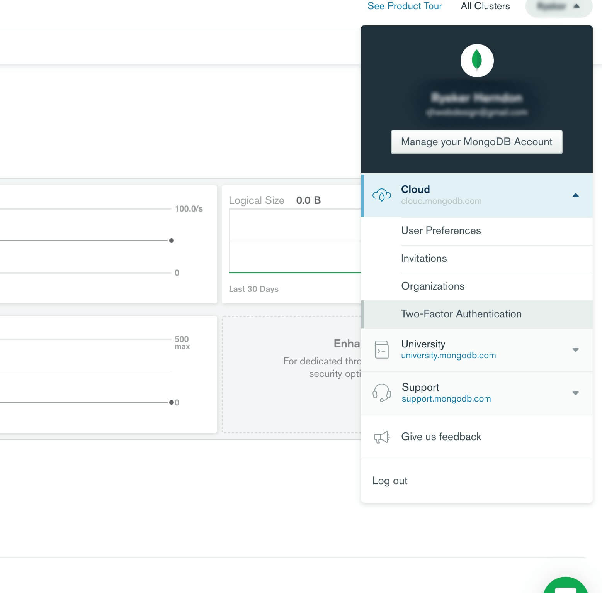
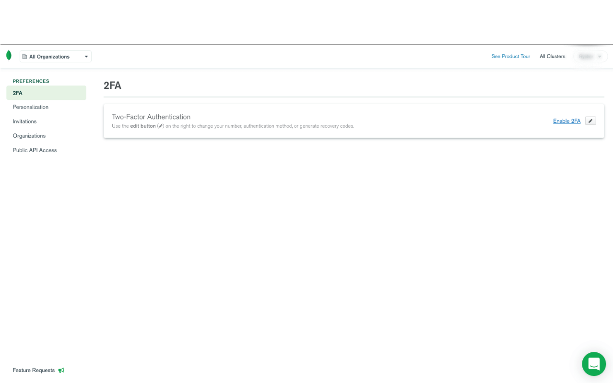

### Sign up

At Shift3 we utilize MongoDB's managed cloud database system [MongoDB Atlas](https://www.mongodb.com/cloud/atlas). If you are a developer on a MongoDB project, you should have been given access to Shift3's account with MongoDB Atlas. If you weren't please contact Corey Shuman (cshuman@shift3tech.com) to have your email account added.

Once you are signed up and are able to log in, make sure you enable 2Factor Authentication for your account. This set is **NOT OPTIONAL**.

### Two-Factor Authentication

1. At the top right of the dashboard you will see your username as the title of a drop down. Click on the drop down to reveal your options.
2. Click on `Two-Factor Authentication`
   
3. Click on the blue link text that reads `Enable 2FA`
   
4. Enter your account password & follow the steps to enable 2FA.

### Create a new Cluster
